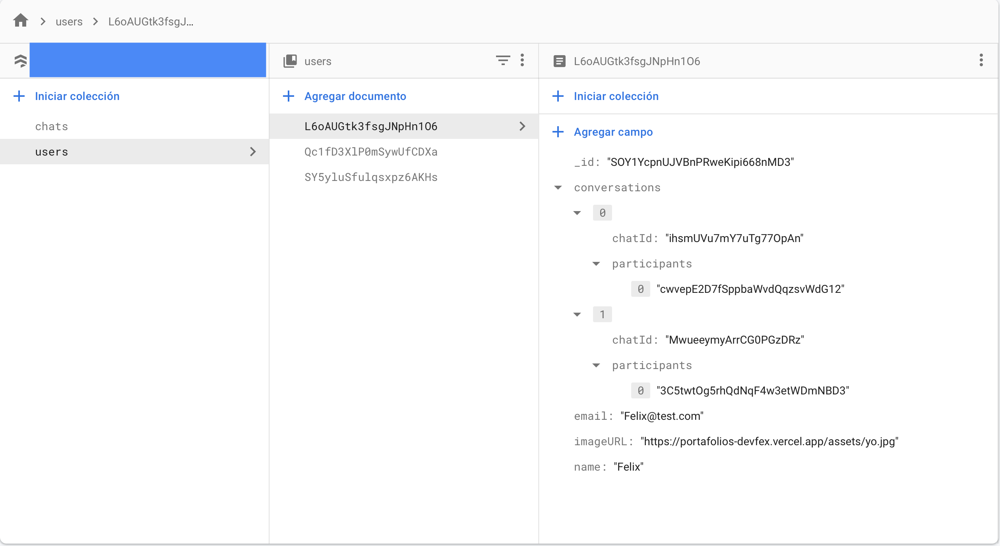
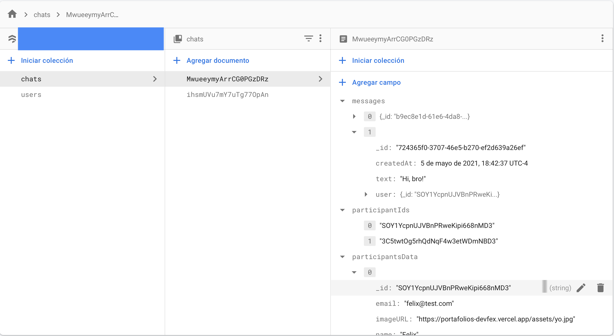
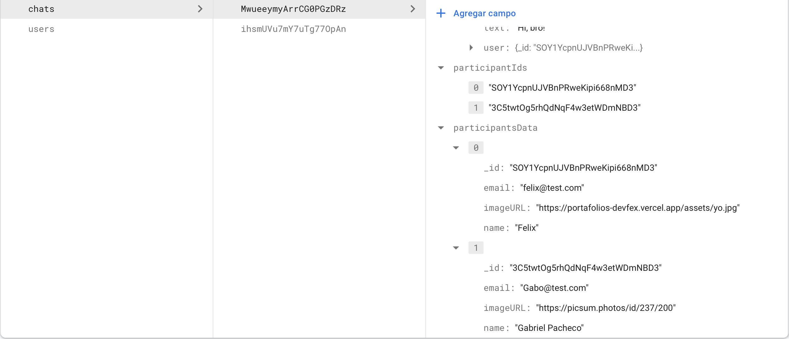

If you read [Firestore Documentation](https://firebase.google.com/docs/firestore), you'll found all information what you need.

## Firestore Structure

I decided on this structure based on practicality and ease.

I have based chat in two collections. `chats` and `users`.

### Users

| field | types  | Detail |
| ------ |------|------|
| _id | string  | Id generated by Firestore.
| conversations | Array  | Conversation objects.
| conversation | Conversation Object  | { chatId: string, participants: [ id of other participant ]}
| email | string  | Email.
| imageURL | string  | Url of image in web.
| name | string  | Name.

### Chats

| field | types  | Detail |
| ------ |------|------|
| messages | Array  | Message objects.
| message | Message Object  | { _id: string, createdAt: Timestamp, text: string, user: OwnerObject}
| participantIds | Array  | Participant Id's Array.
| participantData | Array  | Participants Data.

You may wonder why I didn't get the user's data from their ids?

The answer is: Because at the time of implementing the listeners, it seemed impractical to query the collection of users for each conversation created.

If you know of a better solution ... leave me a review.